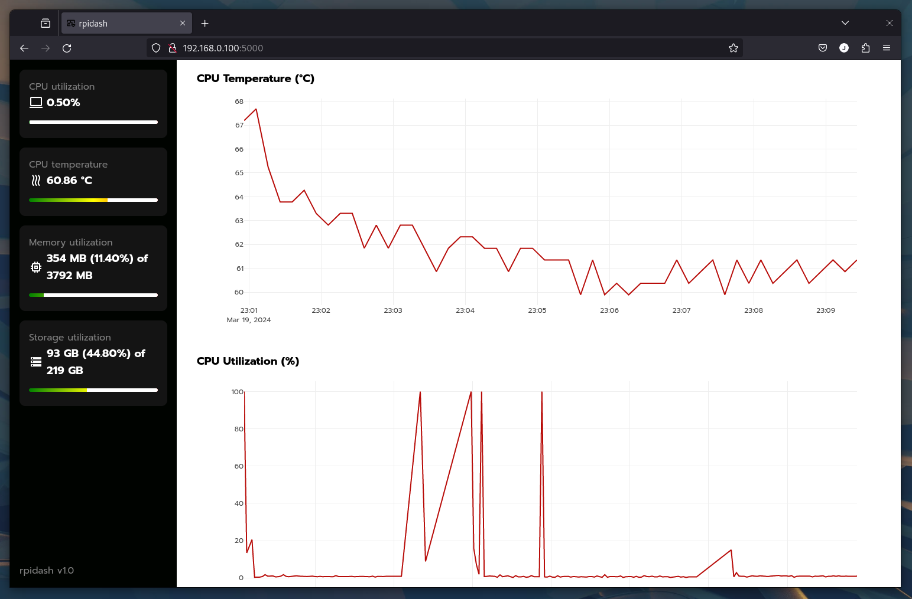

# rpidash

Flask-based dashboard for headless Raspberry Pi system health monitoring.



## Installation

### Docker compose

```YAML
services:
  rpidash:
    image: ghcr.io/jvilkotis/rpidash:latest
    container_name: rpidash
    ports:
      - 5000:5000
    volumes:
      - /path/to/data:/data
    environment:
      UID: 1000
      GID: 1000
      FLASK_ENV: production
    restart: unless-stopped
```

The host directory `/path/to/data` is mounted as `/data` in the container to
store the SQLite database and app configuration persistently.

## Development server

```Shell
python3 -m venv .venv
```

```Shell
. .venv/bin/activate
```

```Shell
pip install -r requirements.txt
```

```Shell
FLASK_ENV=development flask --app rpidash run --debug
```

## Testing

### Unit tests

```Shell
FLASK_ENV=testing python3 -m unittest discover
```

### Coverage

```Shell
FLASK_ENV=testing coverage run -m unittest discover
```

```Shell
coverage report
```

```Shell
coverage html
```